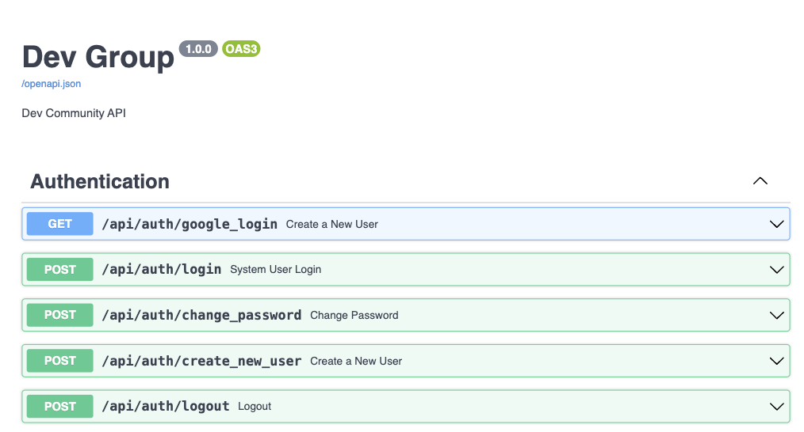
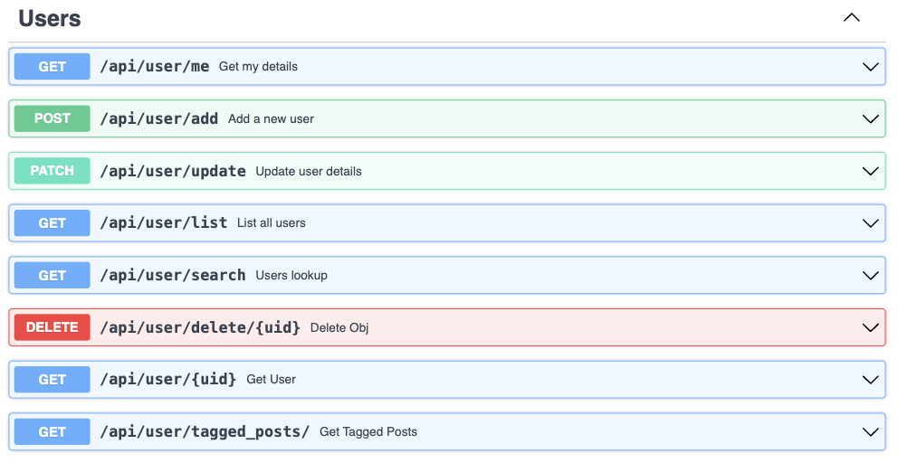
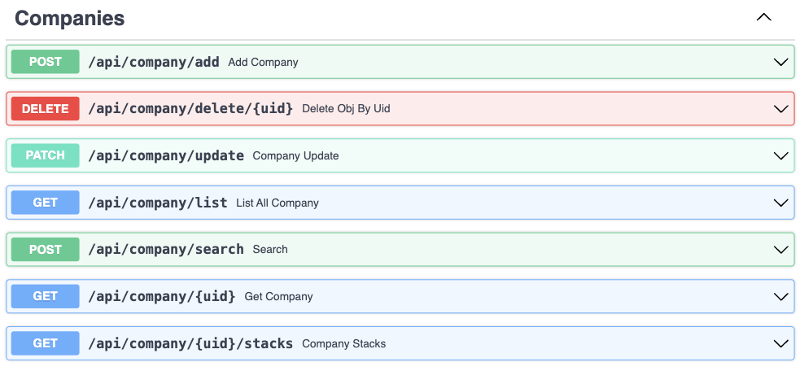
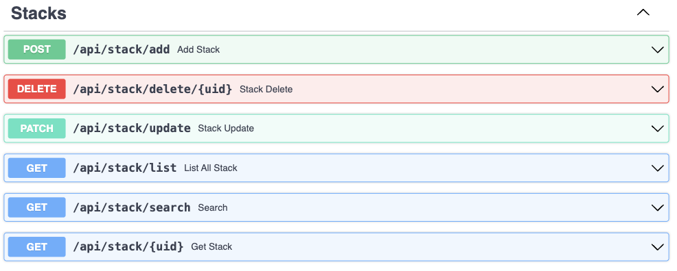
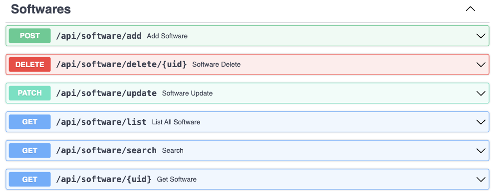
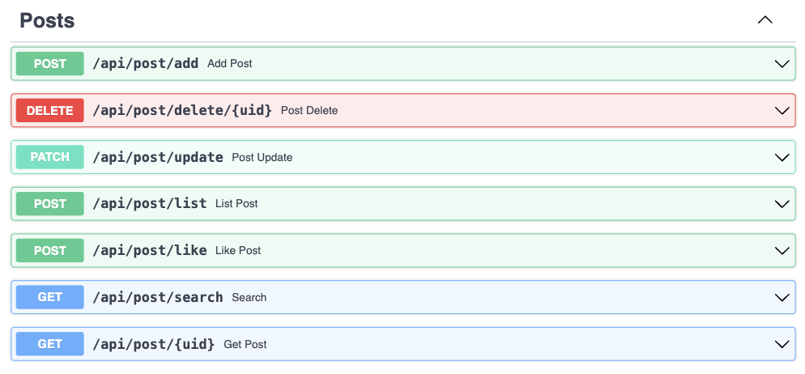
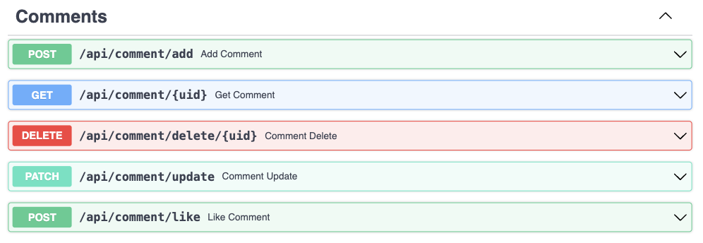
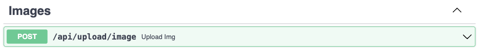
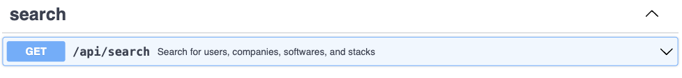
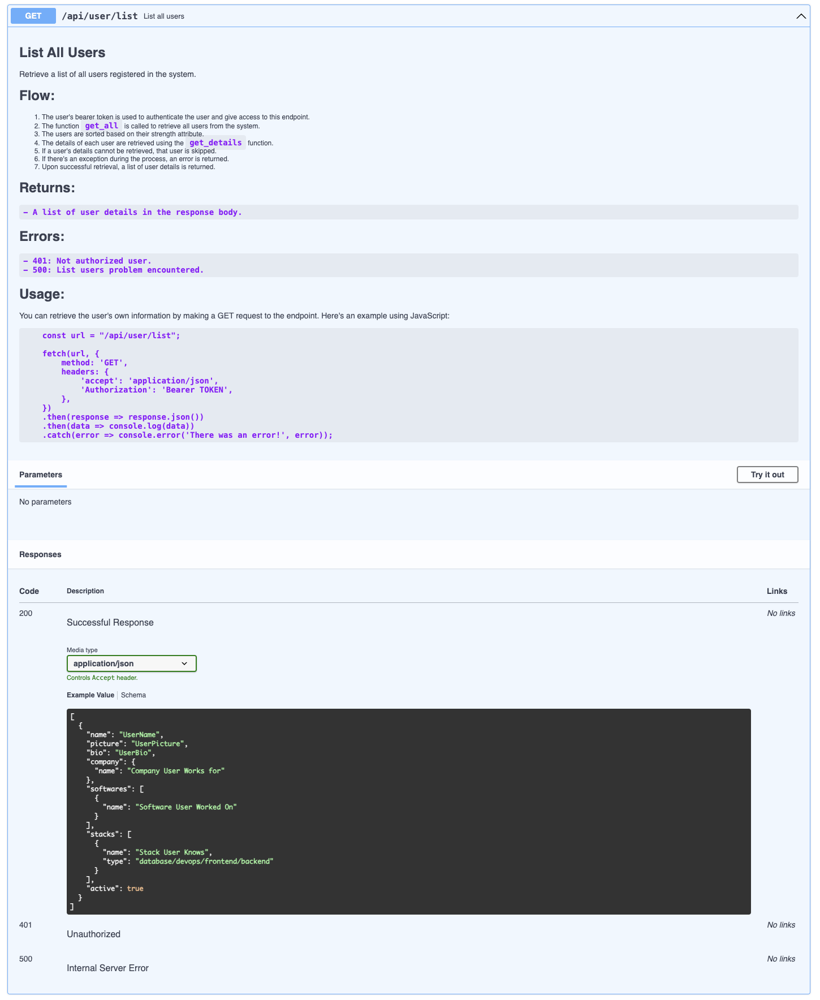

# DEV COMMUNITY
This has certainly been the biggest sole project I have been working so far, and I am very proud of the result. I have learned a lot about the technologies I used, and I am very happy with the result. I hope you like it too!

This project is still in development, and I am planning to add more features in the future. 

```
    I am constantly looking for ways to improve my skills and learn new things. If you see any mistakes or have any suggestions, please let me know. I would be very grateful for your feedback.
```

### Frontend 
For information, please visit the frontend repository 

## Project Aim
The aim of this project is to bring together developers which work for different companies under the same group. This way, they can share their knowledge, ask questions, and help each other.

This idea came to me when I working on company which had a small development team within was part of a bigger group. Most of us had no contact with each other, I thought it would be nice to have a platform where we could share our knowledge, the projects we were working on, and ask for help when needed, bringing us closer together.


## Sections 
- [Authentication](#Authentication) 
- [User](#User)
- [Company](#Company)
- [Stack](#Stack)
- [Software](#Software)
- [Post](#Post)
- [Comment](#Comment)
- [Image](#Image)
- [Search](#Search)
- [Documentation](#Documentation)
- [Like](#Like)
- [Notification](#Notification)
- [Pagination](#Pagination)
- [Cache](#Cache)
- [Tests](#Tests)
- [Docker](#Docker)
- [Logging](#Logging)
- [Error Handling](#Error_Handling)
- [Security](#Security)
- [Performance](#Performance)
- [Scalability](#Scalability)
- [Deployment](#Deployment)

### Authentication <a id="Authentication"></a>
The authentication section allows the user to login into the system by using email and password or using google oauth. Please see the endpoints in image below:


### User <a id="User"></a>
The user section is responsible for managing the users of the platform. Please see the endpoints in image below:


### Company <a id="Company"></a>
The company section is responsible for managing the companies of the platform. Please see the endpoints in image below:


### Stack <a id="Stack"></a>
The stack section is responsible for managing the technology stacks which the users know or are interested in. Please see the endpoints in image below:


### Software <a id="Software"></a>
The software section is responsible for managing the software projects which the users have worked on. Please see the endpoints in image below:


### Post <a id="Post"></a>
The post section is responsible for managing the posts which the users have published. Please see the endpoints in image below:


### Comment <a id="Comment"></a>
The comment section is responsible for managing the comments which the users have published. Please see the endpoints in image below:


### Image <a id="Image"></a>
The image section is responsible for managing the images which the users have uploaded. Please see the endpoints in image below:


### Search <a id="Search"></a>
The search section is responsible for searching the users, companies, software projects, and technology stacks. Please see the endpoints in image below:


### Documentation <a id="Documentation"></a>
All endpoints have been documented using FastAPI's Swagger UI. You can access the documentation by running the application and visiting the `/docs` or '/redoc' endpoint. The documentation provides detailed information about each endpoint, including the parameters, expected responses, and example usage.

please see an example of endpoint documentation below:



### Like <a id="Like"></a>
...

### Notification <a id="Notification"></a>
...

### Pagination <a id="Pagination"></a>
...

### Cache <a id="Cache"></a>
...

### Tests <a id="Tests"></a>
...

### Docker <a id="Docker"></a>
To run the application run the code below in the terminal of the project folder:
```
docker-compose up
```
The application will be available at `http://localhost:8000`


### Logging <a id="Logging"></a>
...

### Error Handling <a id="Error_Handling"></a>
...

### Security <a id="Security"></a>
...

### Performance <a id="Performance"></a>
...

### Scalability <a id="Scalability"></a>
...

### Deployment <a id="Deployment"></a>
...


For information related to the relationship between the different objects, please visit the [Design Page](README/DESIGN.MD)